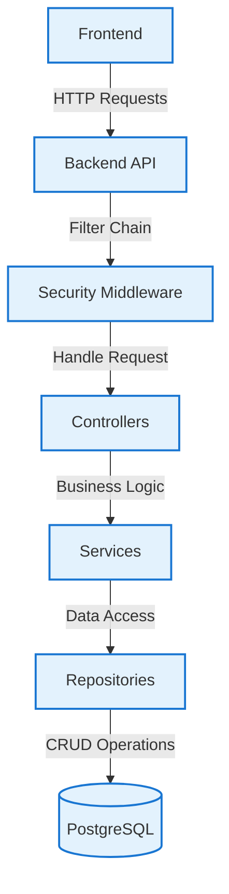

# CampusOS

A modern campus management platform designed to centralize and simplify academic and administrative operations.

[](https://github.com/NITRR-Official/CampusOS/actions/workflows/ci.yml)
[](LICENSE)
[](https://openjdk.org/)
[](https://nodejs.org/)
[](https://www.postgresql.org/)
[](CONTRIBUTING.md)

---

## 📋 Project Introduction

**CampusOS** is a comprehensive campus management system that streamlines academic and administrative operations for educational institutions. It provides a centralized platform for managing students, faculty, departments, courses, examinations, attendance, and more.

**Intended for:** Educational institutions, colleges, and universities seeking a digital infrastructure to automate academic workflows.

**Core problem solved:** Decentralized academic data, manual administrative processes, lack of integration between student services, and inefficient communication channels.

**Key goals:** Provide a secure, scalable, and maintainable platform with role-based access control, comprehensive module coverage, and a clean developer experience.

---

## 🧩 Module Overview

| Module | Description | Status |
|--------|-------------|--------|
| **Authentication** | Secure user authentication and authorization with JWT | Complete |
| **Department Management** | Create and manage academic departments | Complete |
| **Student Management** | Enroll students, track academic progress | Complete |
| **Faculty Management** | Manage faculty assignments and profiles | Complete |
| **Exam Management** | Schedule and manage examinations | **Completed** |
| **Timetable Management** | Generate and manage class timetables | Complete |
| **Attendance Tracking** | Record and monitor student attendance | Complete |
| **Leave Management** | Handle faculty and student leave requests | Complete |
| **Notice & Notifications** | Broadcast announcements and alerts | Complete |
| **Assignment Management** | Distribute and track assignments | Complete |
| **Complaint System** | Submit and resolve student/faculty complaints | Complete |
| **Profile Management** | User profiles and password management | Complete |

---

## 🛠 Technology Stack

| Layer | Technology |
|-------|-----------|
| **Frontend** | Next.js 16.3.0, React 19.2.8, TypeScript, Tailwind CSS 4 |
| **Backend** | Java 25, Spring Boot 4.1.0, Spring Data JPA, Spring Security |
| **Database** | PostgreSQL |
| **Authentication** | JWT (jjwt 0.12.6) |
| **Build tools** | Maven (backend), npm/npx (frontend) |
| **Validation** | Jakarta Bean Validation |
| **API** | RESTful endpoints |
| **Testing** | JUnit, Mockito |
| **Package manager** | npm, Maven |

---

## 🏗 Architecture

CampusOS follows a layered architecture with clear separation of concerns:

```
Frontend (Next.js/React)
   ↓
API / HTTP Requests
   ↓
Backend (Spring Boot)
   ↓
Controllers
   ↓
Services
   ↓
Repositories
   ↓
Database (PostgreSQL)
```

**Plugin Architecture:** The system supports modular feature addition through backend services and frontend page routes. Each major functionality (auth, department, exams, etc.) is implemented as a separate module with its own controllers, services, and repositories.

---

## 📊 Architecture Diagram



---

## 🔐 Authentication & Security Overview

**Signup:** New users register via the frontend authentication flow. Passwords are hashed using bcrypt before storage.

**Login:** Authenticated users receive a JWT token via the login endpoint. The token is stored client-side and sent as a Bearer token on subsequent requests.

**Password hashing:** Bcrypt with appropriate work factor is used for password hashing. Never stores plaintext passwords.

**JWT authentication:** Tokens are signed with a secure secret and include user ID and role claims. Tokens are validated on every protected request.

**Authorization:** Role-based access control (RBAC) determines what endpoints and features each role can access. Roles include: Principal, HOD, Teacher, Student.

**Protected routes:** All backend endpoints except authentication-related routes require a valid Bearer token. The frontend guards pages based on authentication state.

**Bearer token flow:** Client → Login endpoint → JWT token → Include in `Authorization: Bearer <token>` header → Server validates token → Access granted.

**Role/permission handling:** Each user is assigned a role at registration. Role mappings determine endpoint access. HOD role has additional department-scoped permissions.

**Rate limiting:** API endpoints are protected against abuse with configurable rate limits per IP/user.

---

## 📁 Project Structure

```
CampusOS/
├── backend/           # Spring Boot Java backend
│   ├── src/main/java/com/campusos/backend/
│   ├── src/main/resources/
│   ├── pom.xml
│   └── Dockerfile
├── frontend/          # Next.js React frontend
│   ├── src/app/
│   ├── src/components/
│   ├── src/context/
│   ├── src/lib/
│   ├── package.json
│   └── .env.example
├── docs/              # Documentation site
├── .github/           # GitHub workflows and templates
├── package.json       # Root package.json (if applicable)
├── README.md          # This file
└── LICENSE            # License file
```

**Key directories:**

- `backend/`: Java Spring Boot application with REST controllers, services, repositories, and security configuration
- `frontend/`: Next.js 16 application with React 19, TypeScript, and Tailwind CSS 4
- `docs/`: Project documentation including architecture, security, and development guides
- `.github/`: GitHub Actions workflows, PR templates, and issue templates

---

## 📖 Documentation Navigation

### Architecture

- [Backend Architecture](docs/backend-architecture.md)
- [Frontend Architecture](docs/frontend-architecture.md)
- [Plugin System](docs/plugin-system.md)

### Security

- [Authentication](docs/security/authentication.md)
- [Security Guidelines](docs/security/guidelines.md)

### Development

- [Setup](docs/development/setup.md)
- [API Standards](docs/development/api-standards.md)
- [Testing](docs/development/testing.md)

### Module Documentation

- [Authentication Module](docs/modules/authentication.md)
- [Exam Management](docs/modules/exam-management.md)

---

## ⚙️ Installation / Quick Start

### Prerequisites

- Node.js 20.x or higher
- Java 25 JDK
- PostgreSQL 15+
- MongoDB Atlas (if applicable)
- Git

### Installation

1. Clone the repository:
   ```bash
   git clone https://github.com/NITRR-Official/CampusOS.git
   cd CampusOS
   ```

2. Install frontend dependencies:
   ```bash
   cd frontend
   npm install
   ```

3. Install backend dependencies:
   ```bash
   cd ../backend
   mvn install
   ```

### Environment Variables

Copy the `.env.example` files and configure as needed:

```bash
cp frontend/.env.example frontend/.env
cp backend/.env.example backend/.env
```

### Database Setup

1. Create a PostgreSQL database
2. Update `backend/.env` with the database connection string
3. Run migrations/init scripts

### Development Server

**Frontend:**
```bash
cd frontend
npm run dev
```
Available at `http://localhost:3000`

**Backend:**
```bash
cd backend
mvn spring-boot:run
```
Available at `http://localhost:8080`

### Testing

```bash
# Frontend tests
cd frontend
npm test

# Backend tests
cd backend
mvn test
```

---

## 🌐 Environment Configuration

### frontend/.env.example

```env
NEXT_PUBLIC_API_URL=http://localhost:8080
NEXT_PUBLIC_APP_NAME=CampusOS
```

### backend/.env.example

```env
# Database
DATABASE_URL=jdbc:postgresql://localhost:5432/campusos

# JWT
JWT_SECRET=your-secure-jwt-secret
JWT_EXPIRATION=86400

# Mail Configuration
MAIL_HOST=smtp.example.com
MAIL_PORT=587
MAIL_USERNAME=your-email@example.com
MAIL_PASSWORD=your-mail-password
MAIL_FROM=your-email@example.com
```

**Never commit real secrets.** Use placeholders and add `.env` files to `.gitignore`.

---

## 📸 Screenshots

> Screenshots will be added here once available. Place images in `docs/screenshots/` or `frontend/public/screenshots/` and reference them in this section.

```text
docs/screenshots/
├── dashboard.png
├── login.png
└── exam-management.png
```

*No screenshots are currently committed — this placeholder will be replaced with real application captures.*

---

## 🛣 Roadmap

### Completed

- Authentication & Authorization
- Department Management
- Student Management
- Faculty Management
- Exam Management
- Timetable Management
- Attendance Tracking
- Leave Management
- Notice & Notifications
- Assignment Management
- Complaint System

### In Progress

- Advanced Reporting & Analytics
- Mobile Responsiveness improvements

### Planned

- Parent-Teacher Communication
- Fee Management Integration
- AI-powered Attendance Tracking

---

## 🏷 Project Status

> 🚧 **CampusOS is actively under development.**  
> New modules and features are being added regularly. See the roadmap above for current status.

---

## 📦 Repository Metadata

**Description:** A modern campus management platform for academic and administrative operations.

**Topics:** campus-management, college-erp, education, student-management, academic-management, java, spring-boot, postgresql, jwt

---

## 🙋 Contributing

Please see the [CONTRIBUTING.md](CONTRIBUTING.md) file for guidelines on contributing to this project.

## 📄 License

This project is licensed under the [MIT License](LICENSE).